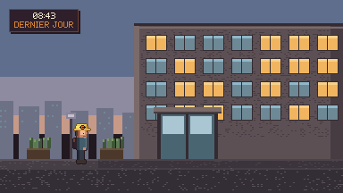
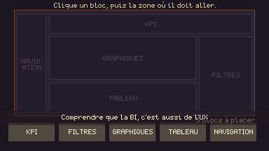
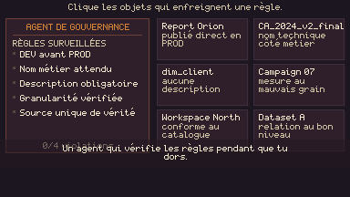
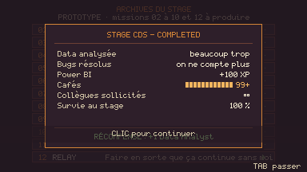
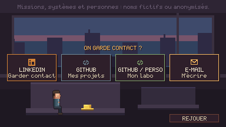

# LAST MISSION — GOOD BYE

Une courte expérience narrative en pixel art : **la dernière journée d'un Data
Analyst**. Le jeu sert de message d'au revoir — on le lance depuis un lien
dans un mail, on y passe environ cinq minutes, et on repart avec l'adresse de
la personne qui l'a écrit.

> Philippe arrive en pensant qu'être Data Analyst consiste surtout à faire des
> graphiques. Douze missions plus tard, il comprend que son métier consiste
> surtout à comprendre, relier, fiabiliser, expliquer… et parfois demander à
> quelqu'un pourquoi un bouton ne marche pas.


## État : prototype jouable (tranche verticale)

Ce dépôt contient une **tranche verticale complète** — l'expérience va du
premier écran jusqu'aux liens de contact, sans trou :

| Acte | Contenu | État |
| --- | --- | --- |
| Premiers pas | extérieur 08:43, accueil, ascenseur, plateau | jouable |
| Comprendre | **Mission 01 · ATLAS** + bouton magique n°1 | jouable |
| Ellipse | missions 02 → 10 en accéléré | montage |
| Transmettre | **Mission 11 · SENTINEL** — agent de gouvernance, bonnes pratiques, bouton magique n°4 | jouable |
| Ellipse | mission 12, bilan de stage | montage |
| Quitter | fermeture des applications, trajet inverse, coucher de soleil, discours | jouable |
| Post-générique | « 2 h 03 de trajet », écran de contact | jouable |

Les quatre liens de contact sont fonctionnels. Ce qui reste à produire est
listé dans [docs/GAME_DESIGN.md](docs/GAME_DESIGN.md) : les dix missions
restantes et les vrais sprites Aseprite.

L'écran-titre propose trois entrées : **JOUER**, **MODE RAPIDE**, et
**ALLER À LA FIN** — qui saute directement au coucher de soleil, au message
d'au revoir et aux contacts, pour les gens pressés.

| | |
| --- | --- |
|  |  |
|  |  |
|  |  |

## Lancer le jeu

Les modules ES et `fetch()` imposent un serveur : ouvrir `index.html` par
double-clic ne fonctionnera pas.

```bash
python -m http.server 8123          # puis http://127.0.0.1:8123
```

Pour une version **qui s'ouvre depuis le disque** (à joindre à un message,
à archiver) :

```bash
node tools/build_single.mjs         # → dist/last-mission.html (~210 Ko)
```

### Commandes

| Touche | Effet |
| --- | --- |
| Clic / Espace | avancer le dialogue, valider |
| Espace maintenu | accélérer la frappe du texte |
| ← → (ou A/D, Q/D) | marcher |
| Tab | passer la cinématique en cours |
| Échap | menu : son, rythme, **retour à l'accueil**, reprendre |
| M | couper le son |
| F1 | affichage de debug |

`index.html#scene=sunset` ouvre directement un plan — pratique pour
travailler une scène sans rejouer le début.

## Structure

```
index.html            page hôte : canvas 384×216, agrandissement entier
src/
  config.js           liens de contact, rendu, rythme  ← le seul fichier à éditer avant diffusion
  main.js             chargement des atlas, table des scènes
  core/               moteur : boucle, scènes, entrées, atlas, audio, police, timeline
  data/               palette verrouillée, texte du jeu (script.js)
  ui/                 dialogues, bannières, notifications
  scenes/             décors procéduraux + mise en scène de chaque acte
assets/               spritesheets PNG + JSON au format Aseprite
tools/                génération des sprites, tests, captures, build mono-fichier
docs/                 game design, bible d'art, pipeline, sécurité
```

Aucune dépendance : pas de `npm install`, pas d'étape de build pour jouer.
Le `package.json` ne sert qu'à regrouper les scripts.

## Choix techniques

- **Canvas logique 384 × 216**, agrandi par facteur entier uniquement
  (×5 = 1920 × 1080 exactement). `imageSmoothingEnabled = false`, toutes les
  positions dessinées sont arrondies : aucun sous-pixel.
- **Décors peints en pixels, personnages en sprites.** Les fonds sont générés
  proceduralement et de façon déterministe (hash sur les coordonnées) : zéro
  octet d'assets de décor, aucun scintillement entre deux images.
- **Police bitmap 5 × 7** écrite à la main, diacritiques français composés.
  Aucune police système, donc aucun anticrénelage.
- **Audio 100 % procédural** (WebAudio) : aucun fichier son dans le dépôt.
- **Mise en scène par générateurs** : une scène = un plan de tournage lisible
  (`yield dlg.say(...)`, `yield hero.walkTo(...)`), pas une machine à états.

## Outils

```bash
python tools/gen_sprites.py     # régénère les spritesheets placeholder
node tools/smoke_test.mjs       # joue le jeu en entier, sans navigateur
node tools/screenshot.mjs       # rend les captures de docs/screens/
node tools/build_single.mjs     # build mono-fichier
```

`tools/softcanvas.mjs` implémente un canvas 2D logiciel : c'est ce qui permet
de rendre le jeu et de faire de la QA visuelle en ligne de commande.

## Sécurité et anonymisation

Le dépôt ne contient **aucun** nom de projet interne, table, hostname,
identifiant de rapport, URL interne ni environnement. Le losange au P sur le
casque est un monogramme personnel, pas une marque d'entreprise : rien
n'identifie l'employeur.

Une exception : **le générique de fin nomme des personnes réelles**
(`T.credits.roles` dans `src/data/script.js`). Leur accord est à obtenir avant
diffusion — c'est le premier point de la checklist de publication.
Les douze missions portent des noms de code fictifs (ATLAS, IRIS, ECHO…), les
PNJ des identifiants anonymisés (`BI_07`, `PO_01`), et les données affichées
sont inventées. La règle complète et la checklist avant publication sont dans
[docs/SECURITY.md](docs/SECURITY.md) — à relire avant toute diffusion.

## Documentation

- [docs/GAME_DESIGN.md](docs/GAME_DESIGN.md) — actes, douze missions, running gag, tonalité, reste à faire
- [docs/ART_BIBLE.md](docs/ART_BIBLE.md) — palette, cellules, pivots, contours, animations, tests de validation
- [docs/PIPELINE.md](docs/PIPELINE.md) — Aseprite → PNG/JSON → moteur, et comment remplacer les placeholders
- [docs/SECURITY.md](docs/SECURITY.md) — doctrine d'anonymisation

Le rendu graphique actuel utilise des **sprites placeholder générés par
script**. Ils respectent déjà la cellule, le pivot, la palette et les noms de
tags définitifs : remplacer les fichiers d'`assets/` par des exports Aseprite
ne demandera aucune modification de code.
