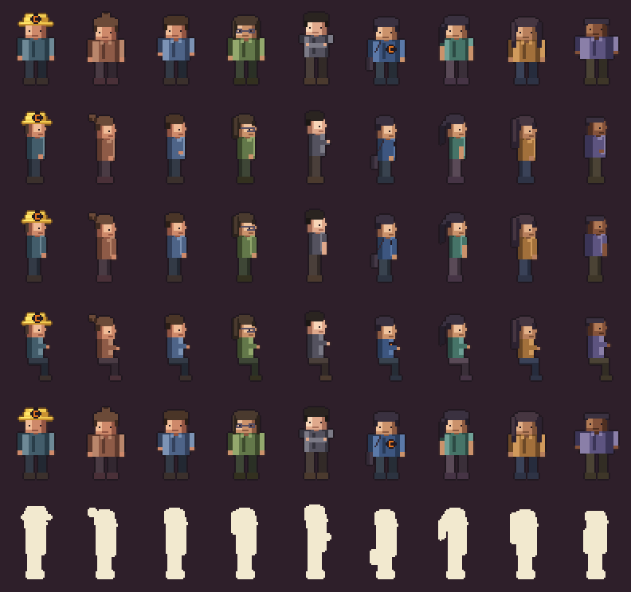

# Les collègues — couche d'ambiance et casting

Adaptation au projet du brief « NPCs / collègues ». Le brief d'origine décrit
une intention ; ce document la traduit en contraintes du dépôt : cellule
48 × 64, palette verrouillée, 1 px de respiration, décors procéduraux
déterministes, doctrine d'anonymisation.

Il complète [ART_BIBLE.md](ART_BIBLE.md) (comment on dessine),
[PIPELINE.md](PIPELINE.md) (comment on produit) et
[GAME_DESIGN.md](GAME_DESIGN.md) (ce qu'on raconte). Il répond au point 4 du
« Reste à produire » : les PNJ manquants.

## L'idée, en une phrase

> Même quand Philippe ne regarde personne, le plateau continue de vivre
> autour de lui.

Le prototype expose quatre PNJ, tous convoqués pour une réplique puis oubliés.
Ce qui manque n'est pas « plus de personnages » : c'est une **couche
d'ambiance** — des gens qui travaillent, traversent, reviennent de réunion, et
dont Philippe n'est pas le centre.

Le piège symétrique est le plateau-fourmilière. À 384 × 216, six personnages
en mouvement, c'est déjà un écran illisible. La règle de survie tient en une
ligne : **un seul mouvement à la fois attire l'œil.** Tout le reste respire.

## Trois rangs, pas seize personnages

Seize PNJ entièrement animés, ce sont ~300 frames de plus — exactement
l'erreur que PIPELINE.md interdit. On les répartit par coût :

| Rang | Ce que c'est | Coût | Effectif visé |
| --- | --- | --- | --- |
| **A — joué** | apparaît en gros plan, parle ou porte un micro-gag | atlas complet, 8 tags | 5 profils |
| **B — ambiant** | traverse, s'assied, discute au loin ; jamais de dialogue | 3 tags (`idle_side`, `walk`, `talk`) | 6 profils |
| **C — silhouette** | occupe une chaise du fond, bouge de 1 px | **aucun sprite** : dessiné dans `backdrops.js` | illimité |

Le rang C est le vrai levier, et il est **fait**. La rangée de bureaux du fond
(`drawFloor`) était déjà peinte en code : y ajouter une tête, des épaules, une
main sur la souris et trois lignes de texte à l'écran a coûté vingt lignes et
zéro octet d'asset. **La moitié de la sensation de vie vient de là.**

Trois postes occupés sur quatre le jour, un seul le soir. Le poste vide
raconte autant que les autres — quelqu'un est en réunion — et le passage de
trois à un, c'est ce qui dit l'heure sans l'écrire.

Ces gens du fond ne sont pas des inconnus : ils reprennent **la tenue et la
coiffure des profils du casting**, à l'échelle du plan. On reconnaît le sweat
bleu, la queue de cheval qui dépasse du dossier, la tenue ocre. Aucun nom
n'est affiché nulle part — c'est précisément le test : si on les reconnaît
sans étiquette, le casting fait son travail.

Budget d'atlas, pour mémoire : `npc_office.png` pèse 8,9 Ko pour 76 frames,
mais son JSON en pèse 28. Les rangs A et B ajoutent ~210 frames, soit ~25 Ko
de PNG et ~78 Ko de JSON — qui repassent en base64 (×1,33) dans
`dist/last-mission.html`, aujourd'hui à 220 Ko. **Le fichier de métadonnées
coûte trois fois le dessin** : c'est lui qu'il faudra dégraisser, pas le PNG.

## Ce qui distingue un PNJ, ici

`npc_skin()` (`tools/rig.py`) n'exposait que deux leviers — une rampe de
chemise, une rampe de cheveux — et huit collègues fabriqués comme ça sont huit
fois la même personne repeinte. Six leviers sont désormais disponibles, dans
cet ordre d'utilité :

| Paramètre | Valeurs | Ce qu'il change |
| --- | --- | --- |
| `style` | `short`, `crop`, `tail`, `long`, `bun`, `curly` | la coiffure — le plus lisible de tous, parce qu'il **déborde** du crâne |
| `height` | `-1` à `+2` | la longueur des jambes ; **la ligne de sol ne bouge pas**, le haut du corps monte |
| `build` | `slim`, `regular`, `broad` | −1 à +2 px d'épaule |
| `sleeves` | `long`, `short` | l'avant-bras redevient peau : ça casse la colonne de tissu |
| `collar` | booléen | col ouvert : deux pixels sous le cou, chemise contre sweat |
| `arm` | `side`, `pocket`, `cross` | la posture au repos — **le seul levier qui change le contour au lieu de le remplir** |
| `bag` | booléen | sac en bandoulière : une bosse à la hanche, hors gabarit |
| `glasses` | booléen | monture claire autour des yeux, pont à hauteur d'œil |
| `trousers` | rampe de 2 tons | le bas du corps — de profil, c'est la moitié de la silhouette |
| `shoes` | 1 ton | la ligne de sol du personnage |
| `skin` | rampe de 3 tons | la carnation |
| `logo` | booléen | la marque sur le sweat (voir plus bas) |

Trois règles sont sorties du test silhouette, et elles valent plus que les
paramètres eux-mêmes :

1. **Une coiffure qui reste dans le gabarit du crâne ne distingue personne.**
   Chaque style déborde d'au moins deux pixels dans une direction qui lui est
   propre : le chignon en arrière-haut, la queue en arrière-bas, les cheveux
   longs sur les côtés et sous les épaules, la coupe courte en **retirant** de
   la matière. Deux pixels, c'est le minimum qui survit à l'aplat.
2. **Un noir à `#241C22` se confond avec le contour `#211820`.** La coiffure
   devient un trou et la silhouette perd sa moitié haute. Les noirs ont été
   remontés d'un cran et tirés vers le froid : ils restent noirs à l'œil, et
   se détachent du contour.
3. **Sans cou, la tête est posée sur le torse** et le personnage fait bonhomme
   de neige. Un pixel de peau plus une ligne d'épaules sombre séparent les
   deux masses — c'est ce qui se lit en premier à 1×.

Reste à ajouter : `prop` (objet tenu — tasse, ordinateur, téléphone, feuille,
grille), qui viendra avec les animations signature.

La taille est le levier le plus sous-estimé. Deux pixels de jambe se voient de
loin, ne coûtent rien, et ne touchent ni au pivot ni à la ligne de sol —
quatre feraient dessin animé, et la cellule de 64 px ne les tiendrait plus.

La règle de la Bible d'art s'applique telle quelle : contours **teintés par la
matière**, jamais de noir pur, clusters plutôt que bruit. Une coiffure bouclée
se rend par un cluster irrégulier de 2 px, pas par du dithering.

Et la contrainte de casting du brief tient en une ligne de test : **deux PNJ
ne doivent jamais partager à la fois la coiffure et la rampe de chemise.**
C'est vérifiable mécaniquement, donc c'est une assertion dans
`tools/gen_sprites.py`, pas une bonne intention.

## Casting

La doctrine d'anonymisation interdit les prénoms réels dans la build publique
([SECURITY.md](SECURITY.md)). Les collègues gardent donc leur identifiant de
service comme nom affiché — `BI_07`, `DE_04` — et **c'est le hook qui les rend
reconnaissables**, pas l'étiquette. C'est exactement ce que demande le brief :
on doit pouvoir dire « ah oui, ça c'est totalement lui » sans qu'un joueur
extérieur ait besoin de savoir de qui il s'agit.

Aucune table de correspondance prénom → identifiant ne figure dans ce dépôt,
et ne doit y figurer.

Huit profils existent dans `npc_office.png`. Les quatre premiers étaient déjà
là ; les quatre suivants sont neufs, et c'est ce casting-là qui rendait le
plateau uniforme.

| Id | Silhouette | Où on le voit |
| --- | --- | --- |
| `accueil` | chignon, petite taille, tenue terre cuite | hall d'entrée |
| `PO_01` | le tuteur : cheveux courts, chemise bleue | plateau, accueil du matin |
| `BI_07` | **carré mi-long, lunettes**, vert olive | ATLAS — bouton magique n°1, et le sudoku |
| `DE_04` | grand, mince, **bras croisés**, tenue corail | métro — et la salle de sport |
| `BI_01` | **cheveux courts, sweat bleu à la marque** | métro, plateau |
| `BI_06` | **cheveux longs attachés**, sarcelle, mince | métro, plateau |
| `BI_02` | cheveux longs, tenue ocre | **SENTINEL — c'est elle que Philippe aide** |
| `DE_03` | carnation plus sombre, crop, mauve, carrure large | métro, plateau |



`node tools/cast_sheet.mjs` régénère cette planche. Elle porte deux tests. Le
**test de distinction** : deux collègues qui se ressemblent se voient
immédiatement ici, alors qu'ils passeraient inaperçus dans des scènes où ils
n'apparaissent jamais ensemble. Et le **test silhouette** (dernière rangée,
sprites réduits à un aplat), qui dit la vérité sans ménagement.

Le premier passage était sans appel : huit rectangles identiques, tout se
jouait sur la couleur. La posture a réglé ça. Sept profils sur huit se
reconnaissent maintenant en aplat — le casque, le chignon, la queue, le carré,
les cheveux longs, les bras croisés, le sac. Les mains dans les poches
raccourcissent la silhouette sans la redessiner : c'est le levier le plus
faible des trois, il est réservé aux profils qui n'apparaissent jamais
côte à côte.

La règle qui en sort, et qui vaut pour tout ajout futur : **une coiffure, une
posture ou un accessoire qui reste dans le gabarit du corps ne distingue
personne.** Il faut sortir du contour d'au moins deux pixels.

Restent à produire, avec leurs hooks :

| Id | Rang | Hook visuel | Mise en scène |
| --- | --- | --- | --- |
| `PO_02` | A | **le calme au milieu du bruit** | plateau, fin de journée |
| `DE_02` | B | **la réunion suivante** | couloir, toujours en transit |
| `DE_05` | B | **le swing** | debout, en attente |
| `BI_05` | B | **le tir à trois points** | près de la corbeille |
| `DE_06` | B | **prêt à partir avant tout le monde** | se lève, enfile sa veste |
| `BI_04` | B | **la panne réglée en une touche** | arrive, appuie, repart |
| `DE_01`, `PO_03..05` | C | — | fond de plateau, couloir |

Quelques précisions que le brief demande explicitement et qu'il ne faut pas
perdre en route :

- **`PO_02`, le N+2.** Son gag est un contraste, pas une action : trois
  personnes viennent le voir successivement, il répond calmement à chacune,
  rien ne s'accélère. Techniquement c'est la séquence la plus chère du lot
  (quatre acteurs coordonnés) — elle ne se joue qu'une fois, en fin de
  journée, et elle vaut son coût : c'est ce qui donne au plateau une
  hiérarchie humaine plutôt qu'une foule.
- **`BI_04`, la panne.** Setup 0,6 s (quelqu'un fixe un écran, épaules
  hautes), arrivée, une pression, l'écran passe de `screen_error` à
  `screen_on`, silence d'un demi-temps, départ. C'est le running gag du bouton
  vu depuis l'autre bout : **ne pas le jouer dans ATLAS ni dans SENTINEL**, il
  écraserait les occurrences n°1 et n°4.
- **Les deux collègues du brief qui ne portent aucun gag** restent en rang B
  sans micro-gag : un plateau où tout le monde a une vanne est un plateau de
  sitcom. Leur fonction est d'être simplement là, et chaleureux.
- **Les carnations.** Le groupe est majoritairement clair de peau, avec deux
  écarts assumés — et rien du caractère d'un personnage n'en découle. À cette
  taille, la carnation ne distingue d'ailleurs presque rien : ce sont la
  coiffure, la taille et le pantalon qui font le travail.
- **Le sweat à la marque de `BI_01`.** De face, c'est le losange et le C du
  casque, reproduits sur la poitrine ; de profil, la lettre tomberait à 3 px et
  deviendrait une bouillie, donc il ne reste qu'une tache sombre à cœur orange.
  C'est la **deuxième et dernière** apparition de la marque de l'employeur dans
  le jeu : elle sort de l'exception « limitée au casque » de
  [SECURITY.md](SECURITY.md), mis à jour en conséquence.
- **Les cracks techniques** ne portent ni lunettes ni posture voûtée. Leur
  compétence se lit à la vitesse : `talk` joué à 8 fps au lieu de 4, un pas de
  plus par seconde. Le cliché du geek est explicitement hors sujet.
- **Les adresses de restaurant** sont fictives dans la build publique :
  `LE POULAILLER`, `TRATTORIA 9`, `LE DEUX`. Elles vivent dans `T.lunch.spots`
  (`src/data/script.js`), donc une build privée peut les remplacer en une
  ligne, sans toucher au code.

## Tags à produire

Convention inchangée (`npc/<profil>/<anim>`), lue par `src/scenes/cast.js`.

Rang B — le minimum vital :

```
npc/<profil>/idle_side    npc/<profil>/walk       npc/<profil>/talk
```

Rang A — s'y ajoutent :

```
npc/<profil>/idle         npc/<profil>/sit        npc/<profil>/press
npc/<profil>/meet         npc/<profil>/signature
```

`meet` est la pose de réunion (assis, tête vers l'interlocuteur, hochement de
1 px) : le brief la réclame pour cinq personnages, autant la mutualiser.
`signature` est le seul tag propre à un personnage — swing, tir, grille,
téléphone tendu. **Trois frames au maximum**, jamais plus : à cette échelle,
un geste long devient une gesticulation.

Nommage des fichiers sources, identique au reste :
`npc_bi_03_signature_f002.png`.

## Où la couche s'insère

Le point que le brief ne pouvait pas connaître : **la phase puzzle d'ATLAS est
une interface plein écran**, pas une vue du plateau (`drawReport`, 384 × 216
de rapport BI). Il n'y a physiquement pas de place pour un PNJ d'ambiance
pendant la mission. La couche vit ailleurs :

Depuis, les deux missions **s'ouvrent sur le plateau** avant de basculer dans
leur interface : le temps de la bannière et de l'objectif, on voit Philippe à
son poste et les collègues au travail derrière lui. Une mission qui démarre
sur un tableau de bord plein écran oublie de dire où l'on est.

| Lieu | Fonction | Bande utile |
| --- | --- | --- |
| `drawDeskStage` (ATLAS et SENTINEL, ouverture et gag) | 1 PNJ joué + 3 postes du fond | fond `y = 84..112`, premier plan `y = GROUND+2` |
| `plateau.js` | le cœur de la couche : 3 à 5 PNJ | idem |
| couloir / ascenseur | 1 à 2 traversées | `y = GROUND-6` |
| `mission_sentinel.js` | 1 PNJ joué + 1 fond | idem plateau |
| `outro.js` (métro) | le défilé final | voir plus bas |

Zones, en coordonnées réelles du plateau (`drawFloor`, `GROUND = 178`) :

```
y  96..127   rangée de bureaux du fond     rang C, assis, 1 px de respiration
y 140..160   couloir de traversée          rang B, marche, échelle inchangée
y 172..180   ligne de sol                  rang A + héros
```

Il n'y a pas de mise à l'échelle : un PNJ du fond n'est pas un sprite réduit,
c'est **le même sprite dessiné plus haut, avec moins de contraste**. Réduire
un sprite pixel art casse la grille — c'est le test n°2 de la Bible d'art.

## Hiérarchie visuelle, en valeurs

Le brief donne quatre niveaux ; voici ce qu'ils valent en paramètres :

| Plan | Qui | Vitesse d'anim | Amplitude | Traitement |
| --- | --- | --- | --- | --- |
| 1 | Philippe, PNJ de la scène | 5–8 fps | 1 px | palette pleine |
| 2 | PNJ impliqués | 4–5 fps | 1 px | palette pleine |
| 3 | ambiance | 3 fps | 1 px | `globalAlpha 0.85`, rampe d'un cran plus sombre |
| 4 | silhouettes du fond | 2 fps | 1 px | `globalAlpha 0.7` |

L'atténuation passe par l'alpha **et** par le choix de rampe, jamais par un
voile gris uniforme : la palette est verrouillée, un voile la désaturerait.

## Rotation et décalage — sans hasard

Contrainte propre à ce projet : `tools/screenshot.mjs` et
`tools/smoke_test.mjs` rejouent le jeu hors navigateur, et les décors sont
déterministes par construction (hash sur les coordonnées, jamais
`Math.random`) — c'est ce qui garantit qu'aucun pixel ne scintille et que deux
captures de la même scène sont identiques.

**La couche d'ambiance suit la même règle.** Un PNJ d'ambiance est une
fonction du temps de scène et de son index, pas un tirage :

```js
// src/scenes/ambient.js — esquisse
const phase = (i * 0.618) % 1;          // décalage irrationnel : jamais synchrone
const t     = scene.t * speed + phase * period;
```

Le décalage par nombre d'or donne exactement ce que demande le brief — des
départs échelonnés, des idles de durées différentes, aucune chorégraphie — et
reste reproductible. Trois règles s'y ajoutent :

1. **Un seul micro-gag actif à l'écran.** La couche tient un verrou ; un gag
   qui ne l'obtient pas est simplement sauté, jamais mis en file.
2. **Aucun gag pendant un dialogue ou un plan du bouton magique.**
   `MagicButton` coupe déjà la musique et zoome : la couche se met en pause.
3. **Un PNJ qui sort du champ ne revient pas avant 20 s.** Sinon le plateau
   ressemble à quatre personnes qui tournent en rond, ce qu'il est.

## Micro-gags : la formule et son budget

`Setup → Anticipation → Action → Réaction → Retour à l'idle`, comme le brief.
Traduit au rythme du jeu :

| Temps | Durée | Ce qui se passe |
| --- | --- | --- |
| Setup | 0,4–0,8 s | la situation est lisible sans texte |
| Anticipation | 0,2 s | **une pause**, pas un mouvement |
| Action | 0,3–0,5 s | 3 frames au maximum |
| Réaction | 0,4 s | un seul autre PNJ réagit, de 1 px |
| Retour | 0,3 s | idle, comme si de rien n'était |

Total : moins de deux secondes et demie. Un gag qui dépasse trois secondes
devient une scène, et une scène vole la vedette au premier plan — ce que le
brief interdit.

L'anticipation est le seul endroit où l'on a le droit de ne rien animer. À
1 px d'amplitude, c'est la pause qui fait rire, pas le geste.

## L'épilogue du métro

`outro.js` jouait déjà l'essentiel : Philippe assis près de la vitre, le
casque posé à côté de lui, le paysage qui défile en trois plans. La vie de la
rame est désormais dans **`src/scenes/transit.js`**, et c'est la première
brique de la couche d'ambiance.

Géométrie disponible (`drawTransport`) :

```
x 24..360, y 30..126    la vitre : personne ne passe devant
x 240..332, y 148..178  banquette du fond : deux places assises (x 266, 304)
x 300                   barre verticale : un point d'appui, une silhouette
y 184..192              assise du premier plan : Philippe, à gauche
```

Deux profondeurs, et **aucune mise à l'échelle** — c'est la ligne de sol qui
fait la distance :

| Plan | Sol | Dessiné | Ce qu'on y fait |
| --- | --- | --- | --- |
| fond | `y = 190` | avant Philippe | monter, s'asseoir, rester debout, descendre |
| premier plan | `y = 214` | après Philippe | traverser le champ, entre lui et la caméra |

Le premier plan est passé de 206 à 214 px pour une seule raison, et elle vaut
d'être notée : à 206, la tête du figurant recouvrait celle de Philippe au
moment du croisement. Huit pixels plus bas, elle passe sous son visage. Le
héros n'est jamais masqué, la traversée reste lisible.

Ce que la partition joue aujourd'hui, sur un cycle de 100 secondes :

| Quand | Qui | Quoi |
| --- | --- | --- |
| dès l'ouverture | `BI_07` | déjà assis — la rame n'a pas attendu Philippe |
| 6 s | `PO_01` | traverse au premier plan, de droite à gauche |
| 30 s | `DE_04` | monte, s'assoit, redescend une demi-minute plus tard |
| 46 s | `PO_01` | retraverse, dans l'autre sens |
| 70 s | accueil | s'arrête à la barre, regarde le paysage, repart |

Trois disciplines s'y appliquent, et ce sont elles qui font la différence
entre une rame habitée et un défilé : **jamais plus de deux figurants**, un
profil qui ne revient pas avant vingt secondes, et deux tenues proches en
couleur qui ne se croisent jamais — à cette taille, elles passeraient pour la
même personne.

Reste à produire ici : les six cameos à animation signature (la grille, la
boule de papier, la notification de réunion, le signe de tête du N+2). Ils
demandent les sprites de rang A, pas du code — la partition les accueillera
telle quelle. Ils tiendront en **12 à 16 secondes**, avant l'apparition des
cartes de contact, et resteront interruptibles (`Tab`). Six cameos, pas onze :
le brief en propose treize, mais l'écran final appartient à Philippe.

Deux d'entre eux laissent échapper une **pensée** — deux petites bulles et une
ligne de texte à côté de la tête, en fondu. Ce n'est pas une réplique : ça ne
s'adresse à personne, ça n'attend pas de réponse, et ça n'interrompt rien.

La règle qui empêche ça de devenir gênant tient en une phrase : **on ne pense
à voix haute que ce que le jeu a déjà montré.** `BI_07` a dit son sudoku en
quittant ATLAS, alors elle peut y repenser dans la rame ; `DE_04` a sa séance
de sport, qui est son seul trait établi. Les autres traversent sans rien dire
— une manie inventée au dernier moment ne caractérise personne, elle remplit
du vide.

Ordre de passage, du plus léger au plus chargé :

1. une traversée sans regard — quelqu'un rentre chez lui, c'est tout ;
2. deux collègues qui discutent en marchant, un téléphone tendu ;
3. `BI_03` assise au fond, sur sa grille ; elle ne lève pas les yeux ;
4. `BI_05` et sa boule de papier — la corbeille du wagon, panier, aucune
   célébration visible depuis le premier plan ;
5. `DE_02` traverse, notification, il accélère légèrement ;
6. `PO_02` passe avec deux personnes qui lui parlent, croise Philippe,
   **un signe de tête, sans dialogue.**

Le sixième dure une seconde de plus que les autres, et la musique ne change
pas. C'est le seul moment où la couche d'ambiance a le droit de regarder le
héros. Puis le wagon reprend son bruit, et `MERCI D'AVOIR JOUÉ` s'affiche.

Ton visé, identique à celui du reste du jeu : **nostalgie sans tristesse.**
Personne ne dit au revoir dans cette scène — c'est déjà fait. On regarde
passer des gens qu'on a connus.

## Ordre de production

1. ~~**Rang C** dans `drawFloor`~~ — *fait*. Vingt lignes, aucun asset, et le
   plateau a cessé d'être vide.
2. **L'ordonnanceur déterministe.** *Fait pour la rame* — `transit.js` en est
   la version minimale : une partition de trajets, aucun état, aucun tirage.
   Reste à en tirer `src/scenes/ambient.js` pour le plateau, avec en plus le
   verrou de gag et la pause pendant les dialogues. Testable sans un seul
   sprite neuf, avec les quatre profils existants.
3. **Trois paramètres de rig** (`hair`, `build`, `prop`) et l'assertion de
   distinction, puis les six profils de rang B.
4. **Rang A** : `BI_03` et `PO_02`, les deux seuls qui portent une scène.
5. **Les cameos du métro**, en dernier — la rame vit déjà, il ne reste qu'à
   y faire passer les animations signature.

## Recette

Aux quatre tests de la Bible d'art s'ajoutent trois vérifications propres à la
couche :

- **Test du plan fixe.** Capturer le plateau à 2 s, 8 s, 20 s
  (`node tools/screenshot.mjs`) : trois images différentes, aucun personnage
  téléporté, et deux exécutions identiques au pixel près.
- **Test du regard.** Sur une capture, quelqu'un qui découvre l'image doit
  désigner Philippe en premier. Sinon un PNJ bouge trop, ou brille trop.
- **Test du silence.** Couper la couche entièrement : la scène doit rester
  jouable et lisible. La couche est un décor vivant, jamais une dépendance.

Et le test n°4 de sécurité s'applique intégralement : un hook est un trait
personnel. Le sudoku, le golf, le basket, les bonnes adresses désignent des
personnes réelles pour qui les connaît. **Accord explicite avant diffusion**,
au même titre que le générique de fin.

## Ce qu'on ne fait pas

- Pas de PNJ par-dessus l'interface d'une mission.
- Pas de PNJ mis à l'échelle : on change de rampe, pas de taille.
- Pas de gag pendant un plan du bouton magique.
- Pas de screen shake, pas de particules autour d'un PNJ, pas de bulle de
  dialogue flottante : la couche ne parle pas.
- Pas de personnage construit **uniquement** sur son hook. Le hook sert à
  reconnaître quelqu'un en trois secondes ; il ne dit pas qui il est.
